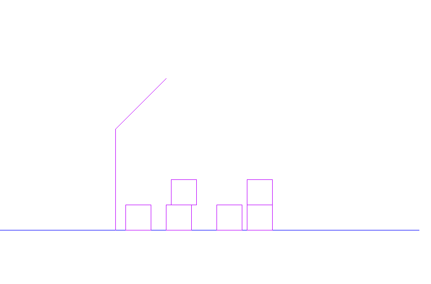

# Project 4 - task 1.1

## Kewin Trochowski Oliwer Lisek



## Introduction

Project was created in WinApi.

A-D - moving the shorter arm.

Left and right arrow keys - moving the longer arm.

Q-E - setting the speed of rotation

F - catch a square

The robot consists of 3 points. First one is on the ground, second point is between 2 arms and the last one is on the end of the robot. There are also 6 squares, each contains of 4 vertexes.

```text
struct coordinates {
    float x;
    float y;
    float Xx;
    float Yy;
    bool block;
};
```

Every point of the robot and squares is a structure shown above. 'x' and 'y'  elements are coordinates to the center at point of the robot on the ground. 'Xx' and 'Yy' elements are coordinates on the window. If square is placed under another square then 'block' equals '1' and you cant move this square.

## Controlling

You can move both arms of the robot. With left and right arrow keys you move the longer arm.

```text
void move(coordinates &G,bool b)
{


if (b == 0)
{
int buff = G.x;
float x = G.x * cos( speed*PI / 180) - G.y * sin(speed * PI / 180);
float y = G.y * cos(speed * PI / 180) + buff * sin(speed * PI / 180);
G.x = x;
G.y = y;
}

else
{
int buff = G.x;
float x = G.x * cos(-speed * PI / 180) - G.y * sin(-speed * PI / 180);
float y = G.y * cos(-speed * PI / 180) + buff * sin(-speed * PI / 180);
G.x = x;
G.y = y;
}
G.Xx = G.x + mid_Ax;
G.Yy = mid_Ay -G.y;
}
```

Moving the first arm of the robot is about rotating every vertex when the beginning of the coorindate system is in the beggining of the arm. 'Speed' defines the speed of rotating. You can either rotate it per one or two degree. (pressing 'q' sets value to 1 and pressing 'e' sets it to 2).

```text
void move2(coordinates& G, bool b)
{

    G.x = G.x - sec.x;
    G.y = G.y-sec.y;

if (b == 0)
{
    int buff = G.x;
    float x = G.x * cos(speed * PI / 180) - G.y * sin(speed * PI / 180);
    float y = G.y * cos(speed * PI / 180) + buff * sin(speed * PI / 180);
    G.x = x;
    G .y = y;
}

else
{
    int buff = G.x;
    float x = G.x * cos(-speed * PI / 180) - G.y * sin(-speed * PI / 180);
    float y = G.y * cos(-speed * PI / 180) + buff * sin(-speed * PI / 180);
    G.x = x;
    G.y = y;
}

    G.x = G.x + sec.x;
    G.y = sec.y + G.y;

    G.Xx = G.x + mid_Ax;
    G.Yy = mid_Ay - G.y;

}
```

Moving the second arm is about the same thing. You just need to move the beggining of the coordinate system to the point between two arms, so you rotate vertexes around new point. In order to move second arm you need to use 'a' and 'd'.

In order to move a square the tip of the robot has to touch the square and then you just click 'f'.

## Gravitation

```text
int fall_info(coordinates tab[],int main)
{
 for (int s = 0; s < how_many_sq; s++)
 {
  if (s == main)
   continue;
  for (int i = 0; i < 4; i++)
  {
   for (int j = 0;j < 4; j++)
   {
    if ((int(tab[i].y) == int(square[s][j].y)) && square_touchingX(tab[i], square[s]) == 1)
    {
     which_sq2 = s;
     return 1;
    }
   }
   
  }
 }
 if (info == 0 && int(tab[0].y) != 0 && int(tab[1].y) != 0 && int(tab[2].y) != 0 && int(tab[3].y) != 0)
  return 0;
 else return 2;
}
```

This function returns 0 if given square isnt touching ground or other square. As long as it returns 0, timer is working and square is falling down.

When the square hits the ground or another square then there is checking another function.

```text
bool fall_info2(coordinates tab[], int main)
{
 int ver=-1,ver2;
 
 for (int i = 0; i < 4; i++)
 {
  if (int(tab[i].y) == 0)
   ver = i;
 }
 if (ver == -1)
 {
  for (int s = 0; s < how_many_sq; s++)
  {
   if (s == main)
    continue;
   for (int i = 0; i < 4; i++)
   {
    for (int j = 0; j < 4; j++)
    {
     if ((int(tab[i].y) == int(square[s][j].y)) && square_touchingX(tab[i], square[s]) == 1)
      ver = i;
    }

   }
  }
 }
   if (ver == 0)
  {
   if (tab[1].y < tab[3].y)
   { 
    ver2 = 1;
    side = 1;
   }
   else
   {
    ver2 = 3;
    side = 0;
   }
  }
  else if (ver == 1)
  {
   if (tab[0].y < tab[2].y)
   {
    ver2 = 0;
    side = 0;
   }
   else
   {
    ver2 = 2;
    side = 1;
   }
  }
  else if (ver == 2)
  {
   if (tab[1].y < tab[3].y)
   {
    ver2 = 1;
    side = 0;
   }
   else
   {
    ver2 = 3;
    side = 1;
   }
  }
  else if (ver == 3)
  {
   if (tab[2].y < tab[0].y)
   {
    ver2 = 2;
    side = 0;
   }
   else
   {
    ver2 = 0;
    side = 1;
   }
  }
   midX = tab[ver].x;
   midY = tab[ver].y;
   if (int(tab[ver2].y) == 0)
    return 1;
   for (int s = 0; s < how_many_sq; s++)
   {
    if (s == which_sq)
     continue;
    for (int i = 0; i < 4; i++)
    {
     for (int j = 0; j < 4; j++)
     {
      if (int(tab[ver2].y) == int(square[s][j].y))
       return 1;
     }

    }
   }
   return 0;
}
```

This function finds the vertex of the square which is the nearest to the ground and sets second timer.

```text
void move3(coordinates& G, bool b)
{

 G.x = G.x - midX;
 G.y = G.y - midY;

 if (b == 0)
 {
  int buff = G.x;
  float x = G.x * cos(PI / 180) - G.y * sin(PI / 180);
  float y = G.y * cos(PI / 180) + buff * sin(PI / 180);
  G.x = x;
  G.y = y;
 }

 else
 {
  int buff = G.x;
  float x = G.x * cos(-PI / 180) - G.y * sin(-PI / 180);
  float y = G.y * cos(-PI / 180) + buff * sin(-PI / 180);
  G.x = x;
  G.y = y;
 }

 G.x = G.x + midX;
 G.y = midY + G.y;

 G.Xx = G.x + mid_Ax;
 G.Yy = mid_Ay - G.y;

} 
```

While second timer is working, the square is rotating relative to the point of square which touches the ground. When the second vertex hits the ground, the timer is stopped.
